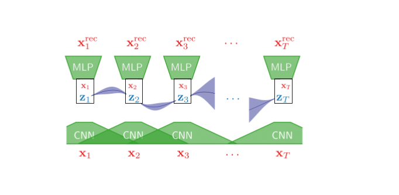
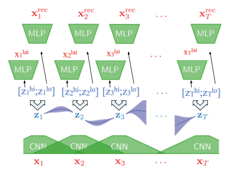
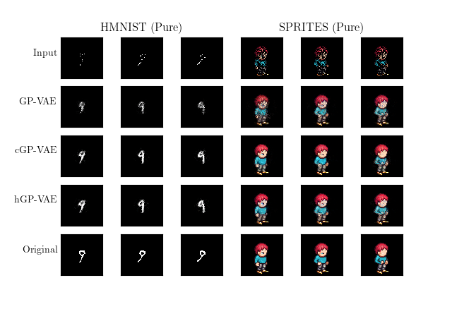
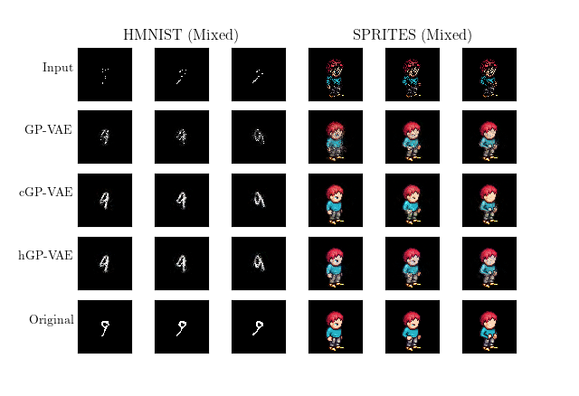

# (Semi-)Supervised Gaussian Process Variational Auto-Encoders Targeted for Video Recovery

## Overview
Our approach utilizes extends Variational Autoencoders with Gaussian Process (GP-VAE) prior for time series imputation paper by Fortuin et. al. This repository
is a fork of the repository used for their paper. 

## Extensions
Our extensions include cGP-VAE (coerced GP-VAE) and hGP-VAE (hybrid GP-VAE).
### cGP-VAE (Coerced GP-VAE)
* This extension model learns a latent representation of the corruption in the input.
* It then uses the learned representation with the original input to reconstruct the image.

### hGP-VAE (Hybrid GP-VAE)
* This extension model learns a latent representation of that combines the traditional Guassian multivariate distribution as well as the corruption representation.
* It then uses a multi-stage decoder to reconstruct the input image.

## Dependencies

* Python >= 3.6
* TensorFlow = 1.15
* Some more packages: see `requirements.txt`

## Run
1. Clone or download this repo. `cd` yourself to it's root directory.
2. Grab or build a working python enviromnent. [Anaconda](https://www.anaconda.com/) works fine.
3. Install dependencies, using `pip install -r requirements.txt`
4. Download data: `bash data/load_{hmnist, sprites}.sh`.
5. Convert and rescale hmnist data by running `python data/convert.py` and `python data/decompress.py`. 
6. Run command `CUDA_VISIBLE_DEVICES=* python newexp.py --model_type {vae, hi-vae, gp-vae, cgp-vae, hgp-vae} --tr_src {hmnist, sprites, both} --val_src --exp_name <your_name> ...`
   
   To see all available flags run: `python train.py --help`
  
## Run Our Experiments
New Experiments use the rescaled HMNIST and Sprites data only. Goal is to optimize for 
general image/video reconstruction. 

The following are commands to run our experiments. Exchange the model type argument to compare hgp-vae, cgp-vae, gp-vae:
  * Train Sprites;Test HMNIST: `python newexp.py --model_type gp-vae --tr_src sprites --val_src hmnist --exp_name sprites_to_hmnist --testing --banded_covar
    --latent_dim 256 --encoder_sizes=32,256,256 --decoder_sizes=256,256,256 --window_size 3 --sigma 1 --length_scale 2 --beta 0.2 --num_epochs 10 --seed 0`
  * Train HMNIST;Test Sprites: `python newexp.py --model_type gp-vae --tr_src hmnist --val_src sprites --exp_name hmnist_to_sprites --testing --banded_covar
    --latent_dim 256 --encoder_sizes=32,256,256 --decoder_sizes=256,256,256 --window_size 3 --sigma 1 --length_scale 2 --beta 0.2 --num_epochs 10 --seed 0`
  * Train Mixed;Test Mixed: `python newexp.py --model_type gp-vae --tr_src both --val_src both --exp_name mixed --testing --banded_covar
    --latent_dim 256 --encoder_sizes=32,256,256 --decoder_sizes=256,256,256 --window_size 3 --sigma 1 --length_scale 2 --beta 0.2 --num_epochs 10 --seed 0`    
   
Remove the `--testing` flag if you want to simply use a validation split for the training data.

If you do remove the `--testing` flag, you must ensure that `--val_src` and `--tr_src` are the same.

## Comparison of Results
Below is a qualitative comparison of our results from training using the homogenous data sets of either just HMNIST data or SPRITES data.

Below is a qualitative comparison of our results from training on the mixed dataset of both HMNIST and SPRITES data.

